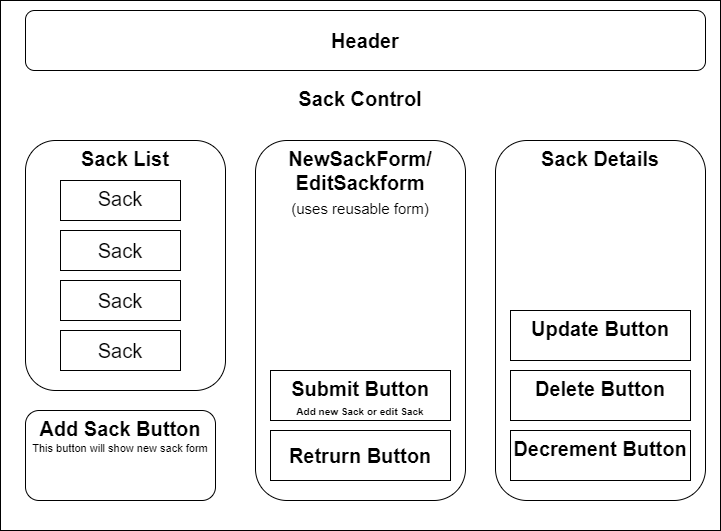

# Coffee Tracker

#### By Ryan Gibson

## Single page webpage that allows the user to add and keep track of coffee sacks. Built using JS, CSS, HTML & React

## Technologies Used

* Javascript
* Html
* CSS
* React

## Description

 This webpage was built using React to allow a user to add sacks of coffee with details. The user can click on individual coffee sacks to expand the details revealing more information and 3 buttons. The user can decrement pounds from the coffee sacks. If they click edit it will bring them to a form where they can edit the details.

 ## Plan For App

 

## Setup/Installation

* Copy the git repository url from the "code" drop down on this github page
* Open a shell program & navigate to your desktop
* Clone the repository using the copied URL and the "git clone" command
* In the shell program, navigate to the root directory of the newly created file called "coffee-tracker"
* Next, run the "npm install" command to install dependencies
* After the updates, in the root directory type "npm run start" to start the program

## Known Bugs

* Cannot creat the details page.

## License

[MIT](LICENSE)

[MIT](https://opensource.org/licenses/MIT)
Any problems or issues please contact ryaninlux@gmail.com

Copyright (c) _2022_ Timothy R Gibson 

